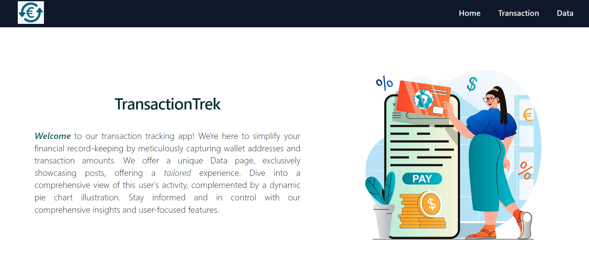
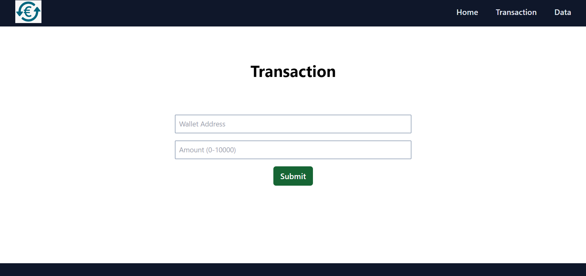
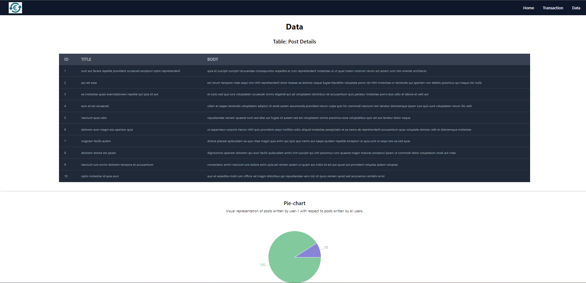
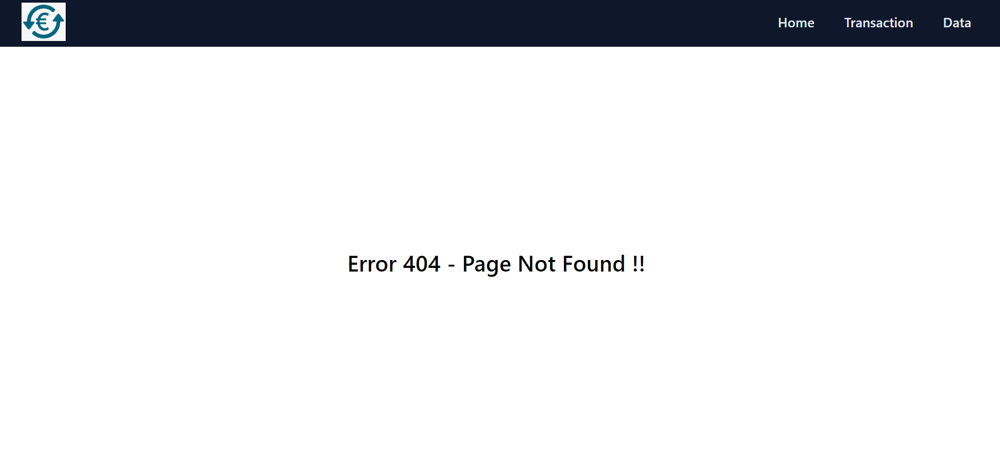

# TransactionTrek App

Welcome to our application! We specialize in meticulous transaction tracking, capturing intricate details like wallet addresses and amounts with precision. Our Data page offers comprehensive insights, displaying user-specific posts via userID selection, complemented by an intuitive pie chart showcasing the distribution of posts by userID against the total volume, empowering users with insightful analytics at their fingertips.

Live: [Transaction Trek](https://transaction-trek.vercel.app/)

- **Home Page:**
  - Overview hub for the application.
  - Navigation header facilitates seamless transition to other pages.

- **Transaction Page:**
  - Enables input of valid wallet address and amount.
  - Stores details in Firestore Cloud with a unique document reference ID.
  - Form validation ensures valid wallet address, proper amount range, and restricts blank submissions.

- **Data Page:**
  - Fetches data from API to display post details for userID=1.
  - Presents a comprehensive table showcasing user-specific posts.
  - Features an insightful pie chart (utilizing recharts) illustrating the distribution of posts by userID=1 versus total posts.

- **Page Not Found:**
  - For invalid routing path shows error message

### Getting Started with Create React App

This project was bootstrapped with [Create React App](https://github.com/facebook/create-react-app).

### Available Scripts

In the project directory, you can run:

### `npm start`

Runs the app in the development mode.\
Open [http://localhost:3000](http://localhost:3000) to view it in your browser.

### `npm run build`

Builds the app for production to the `build` folder.\
It correctly bundles React in production mode and optimizes the build for the best performance.
Your app is ready to be deployed!
